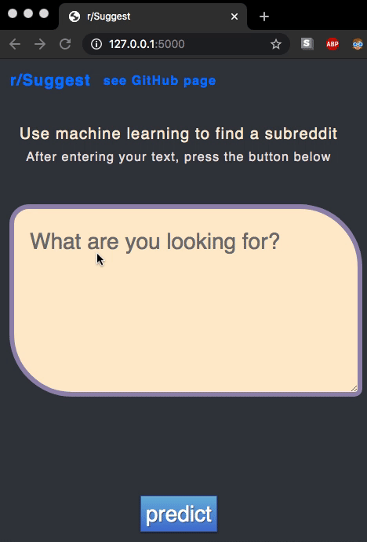

    <h1><b>r/Suggest</b> </h1>
    <h2>ML-generated forum suggestions</h2>
    
    
👽

Direct a user to an appropriate reddit forum using the language model shown [here](https://github.com/schlam/reddit-lsa-classifier/)

### Thoughts

Looking forward to scaling this up with more forums
(model only predicts on ten at the moment),
if any front-end savvy developers are interested in improving the UI and
using this as a base for something else, I'd be happy to merge your pull requests!
